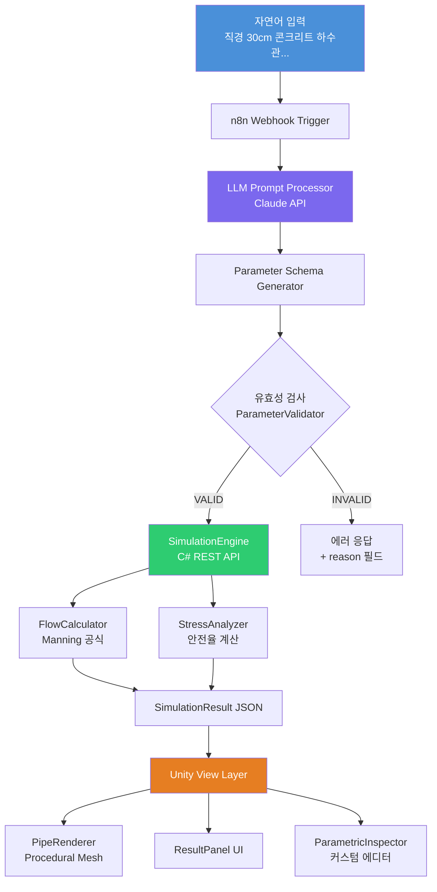
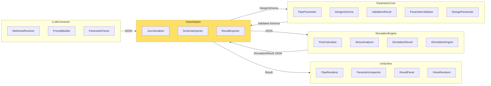
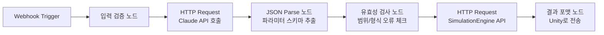
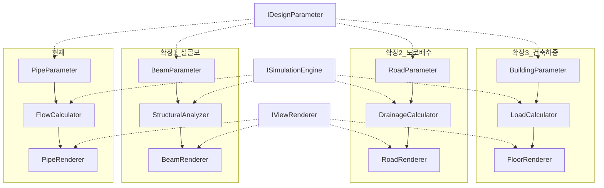

# StructFlow

> AI 기반 구조 설계 자동화 파이프라인 — 자연어 입력에서 3D 시각화까지

**부강테크 포트폴리오 프로젝트** | 설계 소프트웨어 구조 재설계 + LLM 자동화 + 확장 가능 아키텍처

---

## 시스템 아키텍처



---

## 모듈 의존 관계도



> **핵심 원칙**: 모든 모듈 간 통신은 **DataAdapter**를 통해서만 이루어집니다. 직접 참조 없음.

---

## 데이터 스키마

### 입력 파라미터 (PipeParameter)

```json
{
  "pipe": {
    "id": "PIPE-001",
    "diameter_mm": 300,
    "length_m": 50.0,
    "material": "concrete",
    "slope": 0.005,
    "roughness_coefficient": 0.013
  },
  "load": {
    "soil_depth_m": 2.0,
    "traffic_load_kn": 50.0,
    "internal_pressure_kpa": 10.0
  },
  "environment": {
    "flow_type": "gravity",
    "fluid": "wastewater"
  }
}
```

### 시뮬레이션 결과 (SimulationResult)

```json
{
  "pipe_id": "PIPE-001",
  "calculated_at": "2025-02-22T10:00:00Z",
  "flow": {
    "velocity_ms": 1.23,
    "flow_rate_m3s": 0.087,
    "fill_ratio": 0.72,
    "status": "NORMAL"
  },
  "stress": {
    "max_stress_kpa": 145.2,
    "safety_factor": 2.8,
    "status": "SAFE"
  },
  "warnings": [],
  "summary": "설계 기준 내 정상 범위입니다."
}
```

---

## LLM 파이프라인

### n8n 워크플로우 흐름



### 자연어 → 파라미터 변환 예시

**입력:**
```
직경 30cm, 길이 50m 콘크리트 하수관, 경사 0.5%로 설계해줘
```

**LLM 출력:**
```json
{
  "pipe": {
    "diameter_mm": 300,
    "length_m": 50.0,
    "material": "concrete",
    "slope": 0.005
  }
}
```

---

## 시뮬레이션 계산 공식

### Manning 공식 (유량 계산)
> 출처: KDS 57 17 00 (하수도 설계 기준)

$$Q = \frac{1}{n} \cdot A \cdot R^{2/3} \cdot S^{1/2}$$

| 변수 | 설명 | 단위 |
|------|------|------|
| Q | 유량 | m³/s |
| n | Manning 조도계수 (콘크리트: 0.013) | - |
| A | 유수 단면적 | m² |
| R | 동수반경 | m |
| S | 수로 경사 | - |

### 안전율 계산
> 출처: KS D 4301 (원심력 철근 콘크리트관)

```
Safety Factor = 허용응력 / 실제응력

SAFE    : SF >= 2.0  ✅
WARNING : 1.5 <= SF < 2.0  ⚠️
DANGER  : SF < 1.5  ❌
```

---

## 확장 전략



인터페이스(`IDesignParameter`, `ISimulationEngine`, `IViewRenderer`)로 추상화되어 있어, **도메인만 교체하면 파이프라인은 그대로 유지**됩니다.

---

## 프로젝트 구조

```
StructFlow/
├── ParametricCore/          # 설계 파라미터 모델 정의 및 유효성 검사
│   ├── Models/
│   │   ├── PipeParameter.cs
│   │   ├── DesignSchema.cs
│   │   └── ValidationResult.cs
│   ├── Validators/
│   │   └── ParameterValidator.cs
│   └── Interfaces/
│       └── IDesignParameter.cs
│
├── DataAdapter/             # JSON 입출력, 외부 포맷 변환
│   ├── JsonSerializer.cs
│   ├── SchemaImporter.cs
│   └── ResultExporter.cs
│
├── SimulationEngine/        # 물리/구조 계산 엔진
│   ├── FlowCalculator.cs    # Manning 공식 기반 유량 계산
│   ├── StressAnalyzer.cs    # 기본 하중/응력 분석
│   ├── SimulationResult.cs
│   └── Interfaces/
│       └── ISimulationEngine.cs
│
├── LLMConnector/            # n8n → LLM → 파라미터 변환
│   ├── WebhookReceiver.cs
│   ├── PromptBuilder.cs
│   └── ParameterParser.cs
│
├── UnityView/               # 3D 렌더링 + 에디터 UI
│   ├── PipeRenderer.cs      # Procedural Mesh 기반 파이프 렌더링
│   ├── Editor/
│   │   └── ParametricInspector.cs
│   ├── UI/
│   │   └── ResultPanel.cs
│   └── Interfaces/
│       └── IViewRenderer.cs
│
└── n8n/
    └── workflow_structflow.json
```

---

## 개발 로드맵

### 1주차 — 코어 레이어
- [x] PipeParameter C# 모델 클래스
- [x] ParameterValidator 유효성 검사 로직
- [x] JsonSerializer / DataAdapter 구현
- [x] FlowCalculator Manning 공식 구현
- [ ] 단위 테스트 작성

### 2주차 — LLM 연결
- [x] n8n Webhook 트리거 설정
- [x] Claude API 프롬프트 설계
- [x] JSON 파싱 + 유효성 검사 노드
- [ ] SimulationEngine REST API 엔드포인트

### 3주차 — Unity 시각화
- [x] PipeRenderer Procedural Mesh 구현
- [x] ParametricInspector 커스텀 에디터
- [x] ResultPanel UI 구현
- [ ] 전체 파이프라인 E2E 테스트

---

## 기술 스택

| 레이어 | 기술 |
|--------|------|
| AI/LLM | Claude API (Anthropic) |
| 워크플로우 | n8n |
| 시뮬레이션 | C# (.NET) |
| 시각화 | Unity (C#) |
| 데이터 포맷 | JSON Schema |

---

## 참고 자료
- Manning 공식: KDS 57 17 00 (하수도 설계 기준)
- 파이프 허용응력: KS D 4301 (원심력 철근 콘크리트관)
- Unity Procedural Mesh: Unity Docs — ProceduralMesh
- n8n 공식 문서: n8n.io/docs
