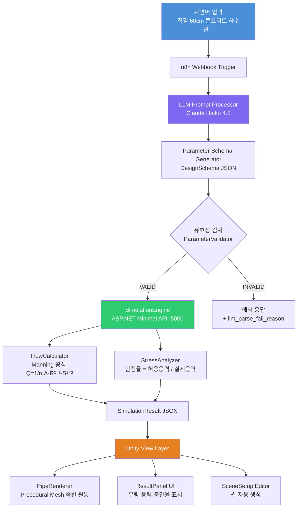
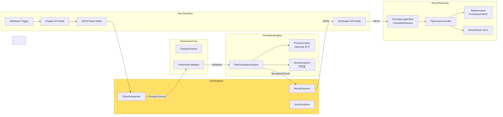

# StructFlow

> **AI 기반 구조 설계 자동화 파이프라인** — 자연어 입력에서 Manning 공식 시뮬레이션, Unity 3D 시각화까지

**부강테크 포트폴리오 프로젝트** | 설계 소프트웨어 구조 재설계 + LLM 자동화 + 확장 가능 아키텍처

---

## 프로젝트 개요

"직경 60cm 콘크리트 하수관, 경사 1%로 설계해줘" 한 줄의 자연어로
Manning 공식 유량 계산 → 응력 안전율 분석 → Unity 3D 파이프 시각화까지
전 과정을 자동화한 E2E 설계 파이프라인입니다.

### 핵심 기술 포인트

| 항목 | 내용 |
|------|------|
| **LLM 파라미터 추출** | Claude API가 자연어에서 구조화된 DesignSchema JSON 생성 |
| **도메인 설계 계산** | KDS 57 17 00 기준 Manning 공식, 설계 충만율 75% 적용 |
| **레이어 격리** | 모든 모듈 간 통신은 DataAdapter JSON 직렬화만 사용 |
| **Unity 시각화** | 절차적 메시(Procedural Mesh)로 실시간 파이프 단면 렌더링 |
| **자동화 워크플로우** | n8n으로 Webhook → LLM → API 전 과정 오케스트레이션 |

---

## 시스템 아키텍처



---

## E2E 실행 결과

### 입력 (자연어 → n8n Webhook)
```
직경 60cm 콘크리트 하수관을 경사 1%, 토피고 2m 조건으로 설계해줘
```

### Claude API 출력 (DesignSchema JSON)
```json
{
  "pipe": { "diameter_mm": 600, "material": "concrete", "slope": 0.01 },
  "load": { "soil_depth_m": 2.0, "traffic_load_kn": 50.0 },
  "environment": { "flow_type": "gravity", "fluid": "wastewater" }
}
```

### SimulationEngine 출력
```json
{
  "pipe_id": "PIPE-001",
  "flow": {
    "velocity_ms": 1.4865,
    "flow_rate_m3_s": 0.209879,
    "fill_ratio": 0.75,
    "status": "NORMAL"
  },
  "stress": {
    "max_stress_kpa": 156.3,
    "safety_factor": 2.43,
    "status": "SAFE"
  },
  "overall_status": "NORMAL",
  "summary": "설계 기준 내 정상 범위입니다. 유속 1.49 m/s, 안전율 2.43."
}
```

---

## 모듈 의존 관계



> **핵심 원칙**: 모든 모듈 간 통신은 **DataAdapter JSON**만 사용. 모듈 간 직접 참조 없음.

---

## 시뮬레이션 계산 공식

### Manning 공식 (KDS 57 17 00)

$$Q = \frac{1}{n} \cdot A \cdot R^{2/3} \cdot S^{1/2}$$

| 변수 | 설명 | 단위 |
|------|------|------|
| Q | 유량 | m³/s |
| n | 조도계수 (콘크리트: 0.013) | — |
| A | 유수 단면적 | m² |
| R | 동수반경 = A / 윤변 | m |
| S | 수로 경사 | — |

**설계 충만율**: KDS 기준 기본 **75%** 적용 (`DesignFlowM3S = fullFlow × 0.75`)

### 안전율 (KS D 4301)

```
Safety Factor = 허용응력 / 실제응력

SAFE    : SF ≥ 2.0  ✅
WARNING : 1.5 ≤ SF < 2.0  ⚠️
DANGER  : SF < 1.5  ❌
```

---

## 프로젝트 구조

```
StructFlow/
├── ParametricCore/              # 설계 파라미터 모델 + 유효성 검사
│   ├── Models/
│   │   ├── PipeParameter.cs     # 관경, 경사, 재질, 조도계수
│   │   ├── DesignSchema.cs      # 전체 입력 루트 스키마 (DesignFlowM3S 포함)
│   │   ├── LoadParameter.cs
│   │   └── EnvironmentParameter.cs
│   ├── Validators/
│   │   └── ParameterValidator.cs
│   └── Interfaces/
│       └── IDesignParameter.cs
│
├── DataAdapter/                 # JSON 직렬화/역직렬화 + 포맷 변환
│   ├── SchemaImporter.cs        # 자연어 LLM 출력 → DesignSchema 병합
│   ├── ResultExporter.cs        # SimulationResult → JSON / Unity Summary
│   └── StructFlowJsonSerializer.cs
│
├── SimulationEngine/            # 물리·구조 계산 엔진 (도메인 핵심)
│   ├── FlowCalculator.cs        # Manning 공식, 부분충만 보정, 설계유량 75%
│   ├── StressAnalyzer.cs        # 토압 + 교통하중 + 내압 안전율
│   ├── PipeSimulationEngine.cs  # ISimulationEngine 구현체
│   ├── FlowResult.cs
│   ├── StressResult.cs
│   ├── SimulationResult.cs
│   └── Interfaces/
│       └── ISimulationEngine.cs
│
├── SimulationApi/               # ASP.NET Minimal API (REST)
│   └── Program.cs               # POST /api/simulate → SimulationResult
│
├── LLMConnector/                # n8n 연동 보조 모듈
│   ├── PromptBuilder.cs
│   └── ParameterParser.cs
│
├── StructFlow.Tests/            # xUnit 단위 테스트 (66/66 통과)
│   ├── FlowCalculatorTests.cs
│   ├── StressAnalyzerTests.cs
│   ├── ParameterValidatorTests.cs
│   └── SchemaImporterTests.cs
│
├── StructFlowUnity/             # Unity 6 시각화 프로젝트
│   └── Assets/Scripts/
│       ├── StructFlow/
│       │   ├── SimulationApiClient.cs  # UnityWebRequest REST 클라이언트
│       │   ├── PipeViewController.cs   # 씬 조율 컨트롤러
│       │   └── PipeRenderer.cs         # 절차적 메시 파이프 렌더러
│       ├── UI/
│       │   └── ResultPanel.cs          # uGUI 시뮬레이션 결과 패널
│       └── Editor/
│           ├── SceneSetup.cs           # StructFlow 메뉴 → 씬 자동 생성
│           └── ParametricInspector.cs  # PipeViewController 커스텀 인스펙터
│
└── n8n/
    └── workflow_structflow.json  # n8n 워크플로우 (가져오기 가능)
```

---

## 실행 방법

### 1. SimulationEngine API 실행
```bash
cd StructFlow
dotnet run --project SimulationApi
# → http://localhost:5000/api/simulate
```

### 2. n8n 워크플로우 실행
```bash
docker-compose up -d  # 또는
docker run -d -p 5678:5678 -v ~/.n8n:/home/node/.n8n n8nio/n8n
```
`n8n/workflow_structflow.json` 가져오기 후 Publish

### 3. E2E 테스트
```bash
curl -X POST http://localhost:5678/webhook/structflow \
  -H "Content-Type: application/json" \
  -d '{"input": "직경 60cm 콘크리트 하수관, 경사 1%, 토피고 2m"}'
```

### 4. Unity 시각화
1. Unity Hub → `StructFlowUnity` 폴더 열기 (Unity 6000.0.62f1)
2. 메뉴 **StructFlow → ▶ Setup Scene (자동 씬 생성)**
3. SimulationEngine 실행 후 **▶ Play**
4. 좌측 하단 **"▶ 시뮬레이션 실행"** 버튼 클릭

### 5. 단위 테스트
```bash
dotnet test StructFlow.Tests
# 결과: 66/66 통과
```

---

## 확장 전략

```mermaid
graph TD
    subgraph 현재 구현
        A1[PipeParameter] --> B1[FlowCalculator] --> C1[PipeRenderer]
    end
    subgraph 확장 1 — 철골보
        A2[BeamParameter] --> B2[StructuralAnalyzer] --> C2[BeamRenderer]
    end
    subgraph 확장 2 — 도로 배수
        A3[RoadParameter] --> B3[DrainageCalculator] --> C3[RoadRenderer]
    end

    I1[IDesignParameter] -.-> A1 & A2 & A3
    I2[ISimulationEngine] -.-> B1 & B2 & B3
    I3[IViewRenderer]     -.-> C1 & C2 & C3
```

인터페이스로 추상화되어 있어 **도메인(파이프→보→배수)만 교체하면 LLM·n8n·Unity 파이프라인은 그대로 재사용**됩니다.

---

## 기술 스택

| 레이어 | 기술 |
|--------|------|
| AI/LLM | Claude Haiku 4.5 (Anthropic API) |
| 워크플로우 자동화 | n8n (self-hosted, Docker) |
| 시뮬레이션 API | C# 13 / .NET 9 / ASP.NET Minimal API |
| 설계 계산 기준 | KDS 57 17 00, KS D 4301 |
| 시각화 | Unity 6 (6000.0.62f1) / Procedural Mesh / uGUI |
| 테스트 | xUnit (66 테스트, 100% 통과) |
| 데이터 포맷 | JSON Schema / System.Text.Json |

---

## 참고 자료

- Manning 공식: KDS 57 17 00 (하수도 설계 기준)
- 파이프 허용응력: KS D 4301 (원심력 철근 콘크리트관)
- [n8n 공식 문서](https://docs.n8n.io)
- [Anthropic API 문서](https://docs.anthropic.com)
- [Unity Procedural Mesh](https://docs.unity3d.com/Manual/GeneratingMeshGeometryProcedurally.html)
