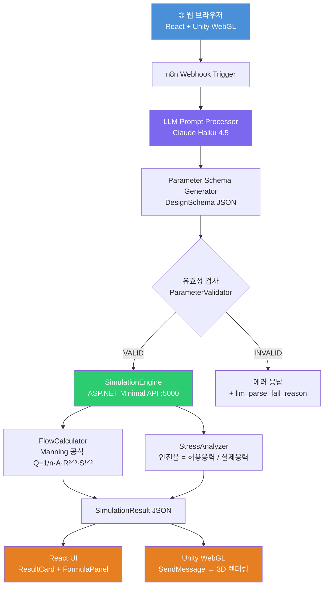
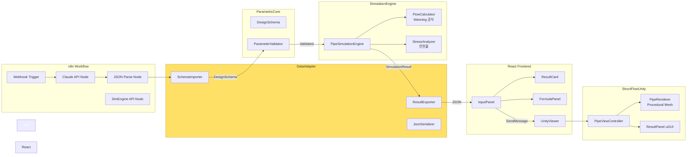

# StructFlow

> **AI 기반 구조 설계 자동화 파이프라인** — 자연어 입력에서 Manning 공식 시뮬레이션, Unity 3D 시각화까지

**부강테크 포트폴리오 프로젝트** | 설계 소프트웨어 구조 재설계 + LLM 자동화 + 확장 가능 아키텍처

> **개발 방식**: [Claude Code](https://claude.ai/code)와의 **바이브 코딩(Vibe Coding)** 협업으로 1일 만에 완성.
> 아키텍처 설계·코드 작성·디버깅·E2E 테스트까지 전 과정을 AI와 페어 프로그래밍으로 진행했습니다.

🌐 **라이브 데모**: http://13.125.245.167

---

## 프로젝트 개요

"직경 60cm 콘크리트 하수관, 경사 1%로 설계해줘" 한 줄의 자연어로
Manning 공식 유량 계산 → 응력 안전율 분석 → Unity 3D 파이프 시각화까지
전 과정을 자동화한 E2E 설계 파이프라인입니다.

### 핵심 기술 포인트

| 항목 | 내용 |
|------|------|
| **LLM 파라미터 추출** | Claude API가 자연어에서 구조화된 DesignSchema JSON 생성 |
| **도메인 설계 계산** | KDS 57 17 00 기준 Manning 공식, 설계 충만율 75% 적용 |
| **레이어 격리** | 모든 모듈 간 통신은 DataAdapter JSON 직렬화만 사용 |
| **Unity WebGL 시각화** | 절차적 메시(Procedural Mesh)로 실시간 파이프 단면 렌더링, 웹 브라우저에서 바로 실행 |
| **공학 수식 설명** | Manning 공식·충만율·안전율(Marston 이론) 계산 근거 실시간 표시 |
| **자동화 워크플로우** | n8n으로 Webhook → LLM → API 전 과정 오케스트레이션 |

---

## 시스템 아키텍처



---

## 웹 프론트엔드

React + Vite로 구현된 싱글 페이지 앱입니다. 별도 설치 없이 브라우저에서 바로 사용 가능합니다.

### 화면 구성

```
┌──────────────────────────────────────────────────────────────┐
│  🏗️ StructFlow                  AI 구조 설계                │
├─────────────────────┬────────────────────────────────────────┤
│  ✏️ 자연어 입력     │  🧊 3D 파이프 시뮬레이션               │
│  ─────────────────  │  ┌──────────────────────────────────┐  │
│  📊 시뮬레이션 결과 │  │                                  │  │
│  • 유속: 1.49 m/s  │  │     Unity WebGL Canvas           │  │
│  • 충만율: 75%     │  │     실시간 파이프 3D 렌더링       │  │
│  • 안전율: 2.43 ✓  │  │                                  │  │
│  • 상태: NORMAL    │  └──────────────────────────────────┘  │
├─────────────────────┴────────────────────────────────────────┤
│  📐 계산 근거 & 공학 수식 (전체 너비)                        │
│  Manning 공식 | 충만율 게이지 | 안전율 SF 게이지 | KDS 기준  │
└──────────────────────────────────────────────────────────────┘
```

### 주요 컴포넌트

| 컴포넌트 | 역할 |
|----------|------|
| `InputPanel` | 자연어 입력 + 예시 입력 버튼 |
| `ResultCard` | 시뮬레이션 수치 (유속·유량·충만율·안전율·상태) |
| `UnityViewer` | Unity WebGL 로더 + SendMessage 연동 |
| `FormulaPanel` | Manning 공식·충만율 바·Marston 하중·SF 게이지·KDS 기준 표 |

---

## E2E 실행 결과

### 입력 (자연어)
```
직경 60cm 콘크리트 하수관을 경사 1%, 토피고 2m 조건으로 설계해줘
```

### Claude API 출력 (DesignSchema JSON)
```json
{
  "pipe": { "diameter_mm": 600, "material": "concrete", "slope": 0.01 },
  "load": { "soil_depth_m": 2.0, "traffic_load_kn": 50.0 },
  "environment": { "flow_type": "gravity", "fluid": "wastewater" }
}
```

### SimulationEngine 출력
```json
{
  "pipe_id": "PIPE-001",
  "flow": {
    "velocity_ms": 1.4865,
    "flow_rate_m3_s": 0.209879,
    "fill_ratio": 0.75,
    "status": "NORMAL"
  },
  "stress": {
    "max_stress_kpa": 156.3,
    "safety_factor": 2.43,
    "status": "SAFE"
  },
  "overall_status": "NORMAL",
  "summary": "설계 기준 내 정상 범위입니다."
}
```

---

## 모듈 의존 관계



> **핵심 원칙**: 모든 모듈 간 통신은 **DataAdapter JSON**만 사용. 모듈 간 직접 참조 없음.

---

## 시뮬레이션 계산 공식

### Manning 공식 (KDS 57 17 00)

$$Q = \frac{1}{n} \cdot A \cdot R^{2/3} \cdot S^{1/2}$$

| 변수 | 설명 | 단위 |
|------|------|------|
| Q | 유량 | m³/s |
| n | 조도계수 (콘크리트: 0.013) | — |
| A | 유수 단면적 | m² |
| R | 동수반경 = A / 윤변 | m |
| S | 수로 경사 | — |

**설계 충만율**: KDS 기준 기본 **75%** 적용 (`DesignFlowM3S = fullFlow × 0.75`)

### 안전율 (KS D 4301)

```
Safety Factor = 허용응력 / 실제응력

SAFE    : SF ≥ 2.0  ✅
WARNING : 1.5 ≤ SF < 2.0  ⚠️
DANGER  : SF < 1.5  ❌
```

---

## 프로젝트 구조

```
StructFlow/
├── ParametricCore/              # 설계 파라미터 모델 + 유효성 검사
│   ├── Models/
│   │   ├── PipeParameter.cs     # 관경, 경사, 재질, 조도계수
│   │   ├── DesignSchema.cs      # 전체 입력 루트 스키마
│   │   ├── LoadParameter.cs
│   │   └── EnvironmentParameter.cs
│   ├── Validators/
│   │   └── ParameterValidator.cs
│   └── Interfaces/
│       └── IDesignParameter.cs
│
├── DataAdapter/                 # JSON 직렬화/역직렬화 + 포맷 변환
│   ├── SchemaImporter.cs
│   ├── ResultExporter.cs
│   └── StructFlowJsonSerializer.cs
│
├── SimulationEngine/            # 물리·구조 계산 엔진 (도메인 핵심)
│   ├── FlowCalculator.cs        # Manning 공식, 부분충만 보정
│   ├── StressAnalyzer.cs        # 토압 + 교통하중 + 내압 안전율
│   ├── PipeSimulationEngine.cs
│   └── Interfaces/
│       └── ISimulationEngine.cs
│
├── SimulationApi/               # ASP.NET Minimal API (REST)
│   └── Program.cs               # POST /api/simulate → SimulationResult
│
├── StructFlow.Tests/            # xUnit 단위 테스트 (66/66 통과)
│   ├── FlowCalculatorTests.cs
│   ├── StressAnalyzerTests.cs
│   ├── ParameterValidatorTests.cs
│   └── SchemaImporterTests.cs
│
├── frontend/                    # React + Vite 웹 프론트엔드
│   ├── src/
│   │   ├── App.tsx              # 2-column 레이아웃 + 하단 수식 패널
│   │   ├── components/
│   │   │   ├── InputPanel.tsx   # 자연어 입력
│   │   │   ├── ResultCard.tsx   # 시뮬레이션 결과 카드
│   │   │   ├── FormulaPanel.tsx # 공학 수식 설명 패널
│   │   │   └── UnityViewer.tsx  # Unity WebGL 로더
│   │   ├── hooks/
│   │   │   └── useSimulation.ts # fetch + 상태 관리
│   │   └── types/
│   │       └── simulation.ts    # TypeScript 타입
│   └── public/
│       └── unity/               # Unity WebGL 빌드 (gitignore, SCP 배포)
│
├── StructFlowUnity/             # Unity 6 시각화 프로젝트
│   └── Assets/Scripts/
│       ├── StructFlow/
│       │   ├── PipeViewController.cs   # 씬 조율 + WebGL SendMessage 수신
│       │   └── PipeRenderer.cs         # 절차적 메시 파이프 렌더러
│       ├── UI/
│       │   └── ResultPanel.cs          # uGUI 결과 패널
│       └── Editor/
│           ├── SceneSetup.cs           # StructFlow 메뉴 → 씬 자동 생성
│           └── ParametricInspector.cs
│
├── deploy/
│   ├── docker-compose.yml       # EC2용 전체 서비스 구성
│   └── nginx.conf               # 리버스 프록시 + Unity WebGL MIME
│
├── .github/workflows/
│   └── deploy.yml               # GitHub Actions CI/CD
│
└── n8n/
    └── workflow_structflow.json  # n8n 워크플로우 (가져오기 가능)
```

---

## 실행 방법

### 웹 UI (라이브)
http://13.125.245.167 접속 → 자연어 입력 → 시뮬레이션 실행

### 로컬 개발

**1. SimulationEngine API**
```bash
dotnet run --project SimulationApi
# → http://localhost:5000/api/simulate
```

**2. n8n + Docker**
```bash
docker-compose -f deploy/docker-compose.yml up -d
```

**3. React 프론트엔드**
```bash
cd frontend && npm install && npm run dev
# → http://localhost:5173
```

**4. Unity WebGL 빌드**
1. Unity Hub → `StructFlowUnity` 폴더 열기 (Unity 6000.0.x)
2. 메뉴 **StructFlow → ▶ Setup Scene** (씬 자동 생성)
3. File → Build Settings → WebGL → Build
4. 출력 폴더: `frontend/public/unity`

**5. 단위 테스트**
```bash
dotnet test StructFlow.Tests
# 결과: 66/66 통과
```

---

## 개발 순서

단일 세션 내 아래 순서로 구현했습니다.

```
1. ParametricCore    — 파이프 파라미터 모델·유효성 검사
2. DataAdapter       — JSON 직렬화/역직렬화, SchemaImporter
3. SimulationEngine  — FlowCalculator(Manning), StressAnalyzer(안전율)
4. StructFlow.Tests  — xUnit 단위 테스트 66건 작성·통과
5. SimulationApi     — ASP.NET Minimal API POST /api/simulate
6. n8n 워크플로우    — Webhook → Claude API → JSON Parse → SimEngine API
7. E2E 디버깅        — 헤더 오류·모델 404·충만율 버그 등 단계별 수정
8. StructFlowUnity   — Unity 6 절차적 메시 파이프 렌더러 + uGUI 결과 패널
9. AWS EC2 배포      — Docker + GitHub Actions CI/CD
10. React 프론트엔드 — InputPanel, ResultCard, UnityViewer, FormulaPanel
```

---

## 확장 전략

```mermaid
graph TD
    subgraph 현재 구현
        A1[PipeParameter] --> B1[FlowCalculator] --> C1[PipeRenderer]
    end
    subgraph 확장 1 — 철골보
        A2[BeamParameter] --> B2[StructuralAnalyzer] --> C2[BeamRenderer]
    end
    subgraph 확장 2 — 도로 배수
        A3[RoadParameter] --> B3[DrainageCalculator] --> C3[RoadRenderer]
    end

    I1[IDesignParameter] -.-> A1 & A2 & A3
    I2[ISimulationEngine] -.-> B1 & B2 & B3
    I3[IViewRenderer]     -.-> C1 & C2 & C3
```

인터페이스로 추상화되어 있어 **도메인(파이프→보→배수)만 교체하면 LLM·n8n·Unity 파이프라인은 그대로 재사용**됩니다.

---

## 기술 스택

| 레이어 | 기술 |
|--------|------|
| **웹 프론트엔드** | React 18 / Vite / TypeScript |
| **AI/LLM** | Claude Haiku 4.5 (Anthropic API) |
| **워크플로우 자동화** | n8n (self-hosted, Docker) |
| **시뮬레이션 API** | C# 13 / .NET 10 / ASP.NET Minimal API |
| **설계 계산 기준** | KDS 57 17 00, KS D 4301 |
| **3D 시각화** | Unity 6 / Procedural Mesh / uGUI / WebGL |
| **테스트** | xUnit (66 테스트, 100% 통과) |
| **인프라** | AWS EC2 / Docker / nginx / GitHub Actions |
| **데이터 포맷** | JSON Schema / System.Text.Json |

---

## AWS 배포

→ **자세한 배포 절차: [DEPLOY.md](./DEPLOY.md)**

### 배포 아키텍처

```
GitHub push to main
        │
        ▼
GitHub Actions CI/CD
  ├─ dotnet test (66건)
  ├─ npm run build (React)
  ├─ docker build & ECR push
  └─ EC2 SSH rolling deploy
        │
        ▼
EC2 t3.micro (Amazon Linux 2023)
  ├─ simulation-api  :5000  (.NET 10 REST API)
  ├─ n8n             :5678  (워크플로우)
  └─ nginx           :80    (리버스 프록시 + React SPA)
        │
        ├─ /                      → React SPA (웹 UI)
        ├─ /unity/                → Unity WebGL 빌드 파일
        ├─ /api/simulate          → SimulationEngine
        ├─ /webhook/structflow/   → n8n Webhook
        └─ /n8n/                  → n8n 관리 UI
```

---

## 참고 자료

- Manning 공식: KDS 57 17 00 (하수도 설계 기준)
- 파이프 허용응력: KS D 4301 (원심력 철근 콘크리트관)
- [n8n 공식 문서](https://docs.n8n.io)
- [Anthropic API 문서](https://docs.anthropic.com)
- [Unity Procedural Mesh](https://docs.unity3d.com/Manual/GeneratingMeshGeometryProcedurally.html)
- [react-unity-webgl](https://react-unity-webgl.dev)
